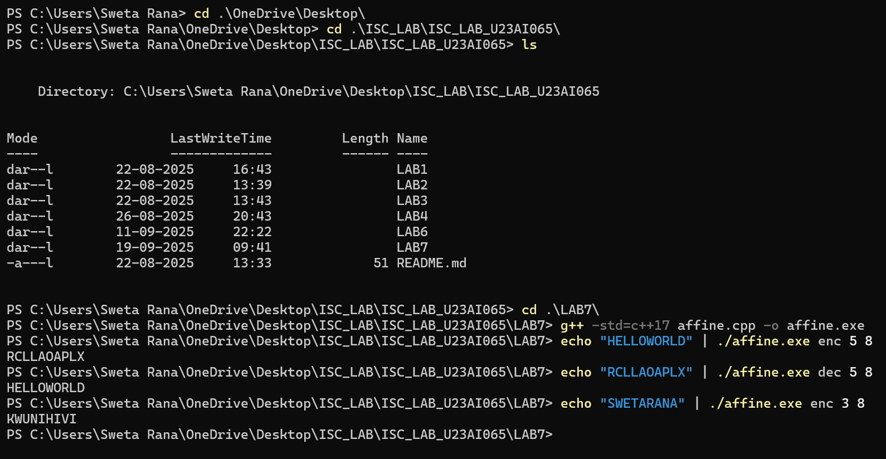

# Lab 7: Affine Cipher Implementation

This project implements the Affine cipher, including encryption, decryption, and a cryptanalysis tool based on frequency analysis.

## 1. Build & Run Instructions

### Build
The program is written in C++17. You can compile it using g++:
```bash
g++ -std=c++17 affine.cpp -o affine
```

### Run
The program takes a mode (`enc`, `dec`, or `cryptanalyze`) and, for encryption/decryption, the key `(a, b)` as command-line arguments. It reads text from standard input.

#### Encryption
Encrypts "HELLOWORLD" with key (5, 8).
```bash
echo "HELLOWORLD" | ./affine enc 5 8
# Expected Output: RCLLAOAPLX
```

#### Decryption
Decrypts "RCLLAOAPLX" with key (5, 8).
```bash
echo "RCLLAOAPLX" | ./affine dec 5 8
# Expected Output: HELLOWORLD
```

#### Cryptanalysis (Task B)
Analyzes a ciphertext from standard input to find the key.
```bash
echo "<ciphertext>" | ./affine cryptanalyze
```

## 2. Text-Handling Policy

As per the provided C++ skeleton, the text-handling policy is as follows:
- **Case Conversion**: All alphabetic characters are converted to **uppercase** before processing[cite: 21].
- **Character Filtering**: Only characters from 'A' to 'Z' are kept. All other characters (spaces, punctuation, digits, etc.) are **dropped** and are not present in the output[cite: 64].

## 3. Task B: Cryptanalysis Approach

### Summary of Approach
The cryptanalysis is performed using a **frequency heuristic** as described in the lab manual[cite: 280]. The core idea is that letters in English text do not appear with equal probability. Specifically, 'E' and 'T' are the two most common letters[cite: 281].

My implementation automates this guess-and-check process:
1.  It first computes the letter frequency profile of the input ciphertext.
2.  It identifies the two most frequent letters in the ciphertext ($y_{max}$ and $y_{2nd}$)[cite: 282].
3.  It then tests two hypotheses:
    * Hypothesis 1: The most frequent ciphertext letter maps to 'E', and the second-most maps to 'T'. $(E \rightarrow y_{max}, T \rightarrow y_{2nd})$[cite: 283].
    * Hypothesis 2: The mappings are swapped. $(E \rightarrow y_{2nd}, T \rightarrow y_{max})$[cite: 283].
4.  For each hypothesis, it solves the resulting system of linear congruences to find a candidate key $(a, b)$[cite: 285]. If the calculated 'a' is valid (i.e., coprime with 26), it uses the key to decrypt the text and prints the candidate key and plaintext.

This strategy succeeded because the statistical properties of the English language are preserved even after a simple substitution cipher like Affine. By correctly guessing the mapping for just two high-frequency letters, we can uniquely determine the key and break the cipher.